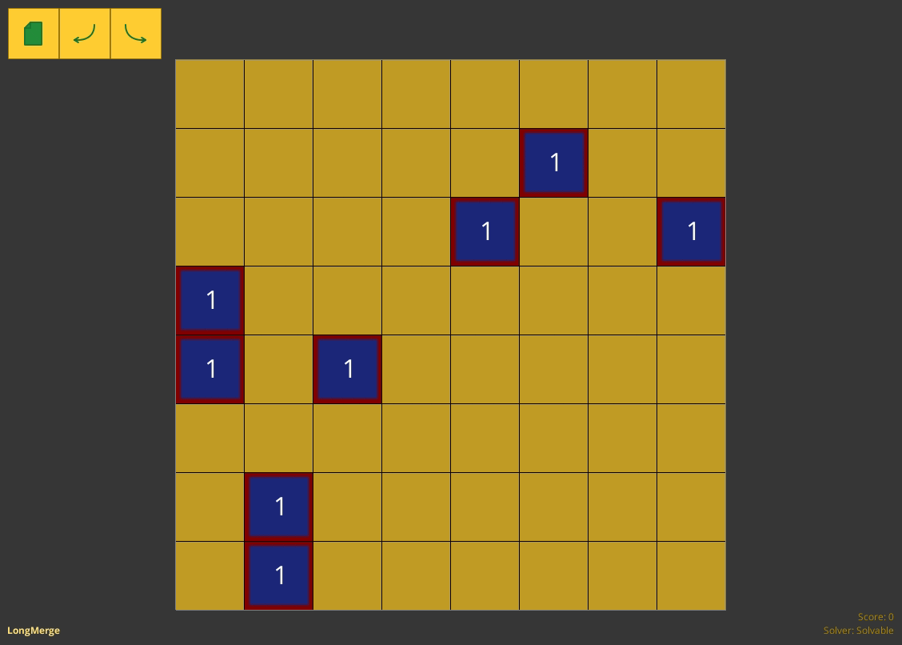

# LongMerge

A 2D single-player sliding tile puzzle video game written in Java/LibGDX.

**The objective**: merge numbered tiles with the same color and number to get the highest possible number of score *(or the highest possible tile number of "power" shown on red bordered squares)*.

Every tile can be moved either up, down, left or right. After each move, the tile draws its trail with the same "power" number. Tiles can be dragged only to the area of tails with the "power" number <u>lower than</u> the tile's one. As a result, *dragged tiles cannot be moved back*. The only way to move back to the "trailed" area is to get a higher "power" number of a draggable plate.

The important thing player should do is not to forget about the "layers" produced by the "trails" or the tile can be stuck and the game might become partly solvable. The more stuck tiles appears on the board, the more game become to its over.

## Platform support

| Desktop      | Android      | iOS                 | Web (HTML5)                       |
|:------------:|:------------:|:-------------------:|:---------------------------------:|
| ✅ Works fine | ✅ Works fine | ⚠️ Not built/tested | ❌ Not planned to be supported |

## Licence

GNU General Public License v3.0 - see LICENCE for more details.

